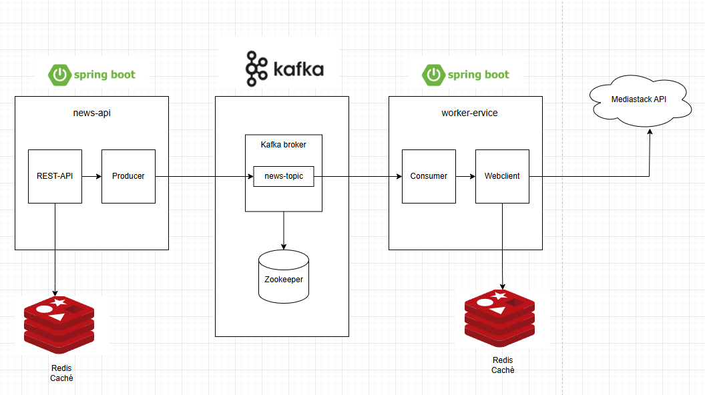
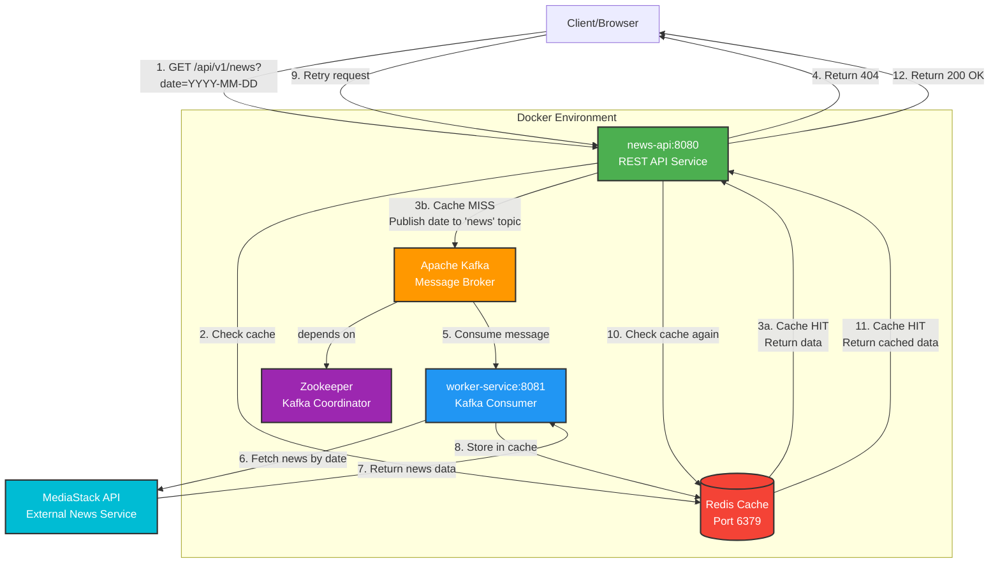

# Spring Boot Kafka Redis Microservices

A microservices architecture demonstrating event-driven communication using Apache Kafka, Redis caching, and Spring Boot with reactive programming.

## Architecture Overview

This project implements a cache-aside pattern with asynchronous data fetching through Kafka messaging. When a client requests news data, the system first checks Redis cache. On a cache miss, it publishes a message to Kafka, which triggers a worker service to fetch data from an external API and populate the cache.

### Architecture Diagram



<details>
<summary>View Mermaid Source (click to expand)</summary>



</details>

## Components

### 1. news-api (Port 8080)
**REST API Service** - Handles client requests and manages cache

- **Technology**: Spring Boot 3.5.7, Spring WebFlux (Reactive)
- **Role**: Producer service
- **Responsibilities**:
  - Exposes REST endpoint for news retrieval
  - Validates date format (YYYY-MM-DD)
  - Checks Redis cache for requested data
  - Publishes messages to Kafka on cache miss
  - Returns cached data on cache hit

### 2. worker-service (Port 8081)
**Background Worker** - Processes Kafka messages and fetches external data

- **Technology**: Spring Boot 3.5.7, Spring WebFlux, WebClient
- **Role**: Consumer service
- **Responsibilities**:
  - Listens to Kafka topic "news"
  - Fetches news from MediaStack API
  - Stores fetched data in Redis cache
  - Handles external API errors gracefully

### 3. Apache Kafka + Zookeeper
**Message Broker** - Enables asynchronous communication

- **Image**: confluentinc/cp-kafka:7.5.0
- **Topic**: news
- **Purpose**: Decouples services and enables async processing

### 4. Redis
**Cache Layer** - Stores news data to reduce API calls

- **Image**: redis:latest
- **Purpose**: Fast data retrieval and reduced external API calls
- **Key Pattern**: Date strings (YYYY-MM-DD)

## Technology Stack

| Technology | Version | Purpose |
|------------|---------|---------|
| Java | 17 | Programming language |
| Spring Boot | 3.5.7 | Application framework |
| Spring WebFlux | - | Reactive web framework |
| Spring Kafka | - | Kafka integration |
| Spring Data Redis | - | Redis integration |
| Project Reactor | - | Reactive programming |
| Gradle | - | Build tool |
| Docker | - | Containerization |
| Apache Kafka | 7.5.0 | Message broker |
| Redis | latest | Caching layer |
| MediaStack API | v1 | External news API |

## Communication Flow

### First Request (Cache Miss)
```
1. Client → GET /api/v1/news?date=2024-01-15
2. news-api → Check Redis cache
3. Redis → Cache MISS (no data found)
4. news-api → Publish "2024-01-15" to Kafka topic "news"
5. news-api → Return 404 with message "Data not found, sending request to broker"
6. worker-service → Consume message from Kafka
7. worker-service → Call MediaStack API with date parameter
8. MediaStack API → Return news data
9. worker-service → Store data in Redis with key "2024-01-15"
```

### Subsequent Requests (Cache Hit)
```
1. Client → GET /api/v1/news?date=2024-01-15
2. news-api → Check Redis cache
3. Redis → Cache HIT (data found)
4. news-api → Return 200 OK with cached news data
```

## Prerequisites

- Docker and Docker Compose
- Java 17 or higher
- Gradle 8.x

## Getting Started

### 1. Clone the repository
```bash
git clone <repository-url>
cd spring-kafka-redis-root
```

### 2. Build the project
```bash
./gradlew clean build -x test
```

### 3. Start all services with Docker Compose
```bash
docker-compose up -d --build
```

### 4. Verify services are running
```bash
docker-compose ps
```

You should see all 5 containers running:
- zookeeper
- kafka
- redis
- news-api
- worker-service

### 5. Check logs
```bash
# All services
docker-compose logs -f

# Specific service
docker-compose logs -f news-api
docker-compose logs -f worker-service
```

## API Endpoints

### Get News by Date

**Endpoint**: `GET /api/v1/news?date={date}`

**Parameters**:
- `date` (required): Date in format YYYY-MM-DD

**Example Request**:
```bash
curl "http://localhost:8080/api/v1/news?date=2024-01-15"
```

**First Request Response** (Cache Miss - 404):
```json
{
  "message": "Data not found, sending request to broker",
  "status": false,
  "data": null
}
```

**Subsequent Request Response** (Cache Hit - 200):
```json
{
  "message": "Data found",
  "status": true,
  "data": {
    "pagination": {...},
    "data": [
      {
        "author": "John Doe",
        "title": "Breaking News...",
        "description": "...",
        "url": "...",
        "source": "...",
        "image": "...",
        "category": "general",
        "language": "en",
        "country": "us",
        "published_at": "2024-01-15T10:00:00+00:00"
      }
    ]
  }
}
```

**Error Response** (Invalid Date Format - 400):
```json
{
  "message": "Validation error",
  "status": false,
  "errors": [
    "Date must be in the format yyyy-MM-dd."
  ]
}
```

## Testing the Complete Flow

1. **First request** (triggers async fetch):
```bash
curl "http://localhost:8080/api/v1/news?date=2024-01-15"
# Returns 404 - data not in cache
```

2. **Wait 2-3 seconds** for worker-service to fetch and cache data

3. **Second request** (returns cached data):
```bash
curl "http://localhost:8080/api/v1/news?date=2024-01-15"
# Returns 200 with news data
```

4. **Monitor worker-service logs**:
```bash
docker-compose logs -f worker-service
# You should see:
# - "Listener received: 2024-01-15"
# - "Response from MediaStack API: ..."
# - "Data successfully cached for date 2024-01-15"
```

## Environment Variables

### news-api
| Variable | Description | Default |
|----------|-------------|---------|
| KAFKA_SERVER | Kafka bootstrap server | kafka:29092 |
| REDIS_SERVER | Redis host | redis |
| REDIS_PORT | Redis port | 6379 |
| REDIS_PASSWORD | Redis password | myredis |

### worker-service
| Variable | Description | Default |
|----------|-------------|---------|
| KAFKA_SERVER | Kafka bootstrap server | kafka:29092 |
| REDIS_SERVER | Redis host | redis |
| REDIS_PORT | Redis port | 6379 |
| REDIS_PASSWORD | Redis password | myredis |
| MEDIASTACK_URI | MediaStack API endpoint | http://api.mediastack.com/v1/news |
| MEDIASTACK_API_KEY | MediaStack API key | (configured in docker-compose.yml) |

## Project Structure

```
spring-kafka-redis-root/
├── news-api/                    # REST API Service
│   ├── src/main/java/
│   │   └── com/alexlondon07/news_api/
│   │       ├── config/          # Kafka, Redis configs
│   │       ├── controller/      # REST controllers
│   │       ├── service/         # Business logic
│   │       ├── repository/      # Redis operations
│   │       ├── models/          # DTOs and responses
│   │       └── utils/           # Constants and utilities
│   ├── Dockerfile
│   └── build.gradle
│
├── worker-service/              # Kafka Consumer Service
│   ├── src/main/java/
│   │   └── com/alexlondon07/worker_service/
│   │       ├── config/          # Kafka, Redis, WebClient configs
│   │       ├── listener/        # Kafka listeners
│   │       ├── service/         # MediaStack integration
│   │       ├── repository/      # Redis operations
│   │       ├── model/           # Domain models
│   │       └── utils/           # Constants
│   ├── Dockerfile
│   └── build.gradle
│
├── docker-compose.yml           # Container orchestration
├── build.gradle                 # Root build configuration
├── settings.gradle              # Multi-module setup
└── README.md                    # This file
```

## Development

### Build specific module
```bash
./gradlew :news-api:build
./gradlew :worker-service:build
```

### Run tests
```bash
./gradlew test
```

### Run locally (without Docker)
Make sure Kafka, Zookeeper, and Redis are running, then:

```bash
# Terminal 1 - news-api
cd news-api
../gradlew bootRun

# Terminal 2 - worker-service
cd worker-service
../gradlew bootRun
```

### Clean and rebuild
```bash
./gradlew clean build
docker-compose down
docker-compose up -d --build
```

## Key Features

- ✅ **Reactive Programming**: Non-blocking I/O with Spring WebFlux and Project Reactor
- ✅ **Event-Driven Architecture**: Decoupled services communicating via Kafka
- ✅ **Cache-Aside Pattern**: Redis caching for improved performance
- ✅ **Asynchronous Processing**: Background workers handle heavy operations
- ✅ **Error Handling**: Comprehensive error handling for external API failures
- ✅ **Validation**: Request validation with Jakarta Validation
- ✅ **Containerization**: Fully containerized with Docker Compose
- ✅ **Scalability**: Kafka consumer groups allow horizontal scaling

## Troubleshooting

### Kafka connection errors
```bash
# Check if Kafka is healthy
docker-compose logs kafka

# Restart Kafka
docker-compose restart kafka
```

### Redis connection errors
```bash
# Check Redis logs
docker-compose logs redis

# Test Redis connection
docker exec -it spring-kafka-redis-root-redis-1 redis-cli
> AUTH myredis
> PING
```

### Service not starting
```bash
# Check service logs
docker-compose logs news-api
docker-compose logs worker-service

# Rebuild from scratch
docker-compose down -v
./gradlew clean build
docker-compose up -d --build
```

### Port already in use
```bash
# Stop all containers
docker-compose down

# Check what's using the port
lsof -i :8080
lsof -i :8081

# Kill the process or change port in docker-compose.yml
```

## Stopping the Application

```bash
# Stop all containers
docker-compose down

# Stop and remove volumes (clears Redis data)
docker-compose down -v
```

## Future Enhancements

- [ ] Add authentication and authorization
- [ ] Implement circuit breaker pattern for external API calls
- [ ] Add metrics and monitoring (Prometheus, Grafana)
- [ ] Implement distributed tracing (Zipkin, Jaeger)
- [ ] Add comprehensive unit and integration tests
- [ ] Implement API rate limiting
- [ ] Add API documentation (Swagger/OpenAPI)
- [ ] Support multiple data sources
- [ ] Implement data persistence (PostgreSQL, MongoDB)
- [ ] Add Kubernetes deployment manifests

## License

This project is for educational purposes.

## Author

Alex London
