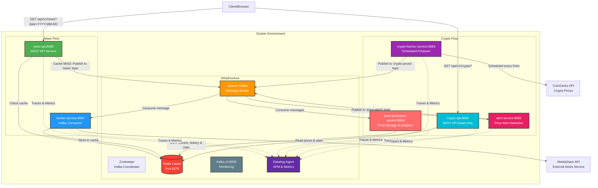

# Spring Boot Kafka Redis Microservices

A microservices architecture demonstrating event-driven communication using Apache Kafka, Redis caching, and Spring Boot with reactive programming and Datadog observability.

## Architecture Overview

This project implements a **cache-aside pattern** with asynchronous data fetching through Kafka messaging. The system includes three main flows:

1. **News Flow**: Fetches news data from MediaStack API on demand
2. **Crypto Flow**: Scheduled fetching of cryptocurrency prices from CoinGecko API
3. **Price Processing**: Consumes crypto prices, stores data, calculates statistics
4. **Alert Detection**: Detects significant price changes and publishes alerts

### Architecture Diagram



---

## Tutorial Progress

This project includes a learning tutorial for building a Crypto Price Tracker. See [CRYPTO_TRACKER_TUTORIAL.md](CRYPTO_TRACKER_TUTORIAL.md) for the complete guide.

| Phase | Service | Status |
|-------|---------|--------|
| Phase 1 | crypto-fetcher-service | COMPLETED |
| Phase 2 | price-processor-service | COMPLETED |
| Phase 3 | alert-service | COMPLETED |
| Phase 4 | crypto-api | COMPLETED |

---

## Services

### 1. news-api (Port 8080)
**REST API Service** - Handles client requests and manages cache
- **Technology**: Spring Boot 3.5.7, Spring WebFlux (Reactive)
- **Role**: Kafka Producer + REST API
- **Swagger UI**: http://localhost:8080/swagger.html
- **OpenAPI Docs**: http://localhost:8080/v3/api-docs
- Exposes `GET /api/v1/news?date=YYYY-MM-DD` for news retrieval
- Validates date format (YYYY-MM-DD)
- Checks Redis cache first; on cache miss, publishes to Kafka topic `news`
- Returns cached data on cache hit (200) or triggers async fetch (404)

### 2. worker-service (Port 8081)
**Background Worker** - Processes Kafka messages and fetches external data
- **Technology**: Spring Boot 3.5.7, Spring WebFlux, WebClient
- **Role**: Kafka Consumer
- Listens to Kafka topic `news`
- Fetches news from MediaStack API
- Stores fetched data in Redis cache
- Custom `ExternalApiException` for API error handling

### 3. crypto-fetcher-service (Port 8083)
**Scheduled Producer** - Fetches crypto prices and publishes to Kafka
- **Technology**: Spring Boot 3.5.7, Spring WebFlux, WebClient
- **Role**: Scheduled Kafka Producer
- Fetches **BTC, ETH, SOL** prices from CoinGecko API every **5 minutes**
- Publishes to Kafka topic `crypto-prices` with symbol as message key
- Configurable interval via `scheduler.fetch-interval` (default: 300000ms)

### 4. price-processor-service (Port 8084)
**Price Storage and Analytics** - Consumes crypto prices and stores data
- **Technology**: Spring Boot 3.5.7, Spring Data Redis Reactive, Jackson JSR310
- **Role**: Kafka Consumer + Redis Writer
- Listens to topic `crypto-prices` with **3 concurrent consumers**
- Stores current price, maintains history, and calculates statistics (min, max, avg)
- Uses running average algorithm for efficient stat calculation
- Records Datadog metrics: price changes, volatility, processing duration

### 5. alert-service (Port 8085)
**Price Alert Detection** - Detects significant price changes and publishes alerts
- **Technology**: Spring Boot 3.5.7, Spring Kafka
- **Role**: Kafka Consumer + Kafka Producer
- Consumes from `crypto-prices` topic
- Maintains in-memory last prices per symbol (ConcurrentHashMap)
- Detects changes >= threshold and generates `PriceAlert` events
- Publishes alerts to `price-alerts` topic with symbol as key
- Alert types: `PRICE_INCREASE`, `PRICE_DECREASE`
- Uses `ErrorHandlingDeserializer` with type mappings for cross-service deserialization

**Alert JSON Example:**
```json
{
  "symbol": "BTC",
  "alertType": "PRICE_INCREASE",
  "previousPrice": 65917.0,
  "currentPrice": 66151.0,
  "changePercent": 0.35,
  "timestamp": "2024-01-15T10:05:00Z",
  "message": "BTC increased 0.35% from $65917.0 to $66151.0"
}
```

### 6. crypto-api (Port 8086)
**Crypto REST API** - Read-only API for cryptocurrency data
- **Technology**: Spring Boot 3.5.7, Spring WebFlux, Spring Data Redis Reactive
- **Role**: REST API (Read-only from Redis)
- **Swagger UI**: http://localhost:8086/swagger.html
- **OpenAPI Docs**: http://localhost:8086/v3/api-docs
- Exposes reactive endpoints for current prices, individual prices, and statistics
- Reads data stored by `price-processor-service`

**Endpoints:**
| Method | Endpoint | Description |
|--------|----------|-------------|
| GET | `/api/v1/crypto/symbols` | List of available cryptocurrency symbols |
| GET | `/api/v1/crypto/prices` | All current prices |
| GET | `/api/v1/crypto/prices/{symbol}` | Price by symbol (BTC, ETH, SOL) |
| GET | `/api/v1/crypto/stats/{symbol}` | Statistics by symbol (min, max, avg) |

---

## Infrastructure

| Component | Image | Port | Purpose |
|-----------|-------|------|---------|
| Zookeeper | confluentinc/cp-zookeeper:7.5.0 | 22181 | Kafka coordinator |
| Kafka | confluentinc/cp-kafka:7.5.0 | 29092 | Message broker |
| Kafka UI | provectuslabs/kafka-ui:latest | 8090 | Monitoring dashboard |
| Redis | redis:latest | 6379 | Cache and data storage |
| Datadog Agent | datadog/agent:latest | 8126, 8125/udp | APM traces and DogStatsD metrics |

---

## 📚 Swagger/OpenAPI Documentation

Interactive API documentation is available for all REST services:

| Service | Swagger UI | OpenAPI Docs |
|---------|------------|--------------|
| **News API** | http://localhost:8080/swagger.html | http://localhost:8080/v3/api-docs |
| **Crypto API** | http://localhost:8086/swagger.html | http://localhost:8086/v3/api-docs |

### News API Endpoints

| Method | Endpoint | Description |
|--------|----------|-------------|
| GET | `/api/v1/news?date={YYYY-MM-DD}` | Get news articles by date |

### Crypto API Endpoints

| Method | Endpoint | Description |
|--------|----------|-------------|
| GET | `/api/v1/crypto/symbols` | List of available cryptocurrency symbols |
| GET | `/api/v1/crypto/prices` | All current cryptocurrency prices |
| GET | `/api/v1/crypto/prices/{symbol}` | Current price by symbol (BTC, ETH, SOL) |
| GET | `/api/v1/crypto/stats/{symbol}` | Price statistics (min, max, avg, sample count) |

### Using Swagger UI

1. Open your browser to the Swagger UI URL
2. Click on any endpoint to expand its details
3. Click "Try it out" to test the endpoint directly
4. See request/response schemas, parameters, and response codes

---

## Kafka Topics

| Topic | Producer | Consumer(s) | Key | Value |
|-------|----------|-------------|-----|-------|
| `news` | news-api | worker-service | Date (YYYY-MM-DD) | Date string |
| `crypto-prices` | crypto-fetcher-service | price-processor-service, alert-service | Symbol (BTC/ETH/SOL) | CryptoPrice JSON |
| `price-alerts` | alert-service | — | Symbol | PriceAlert JSON |

---

## Redis Key Patterns

| Key Pattern | Type | Service Writer | Service Reader | Purpose |
|-------------|------|----------------|----------------|---------|
| `{YYYY-MM-DD}` | String | worker-service | news-api | Cached news articles |
| `crypto:current:{SYMBOL}` | String (JSON) | price-processor-service | crypto-api | Current price |
| `crypto:history:{SYMBOL}` | List | price-processor-service | crypto-api | Historical prices |
| `crypto:stats:{SYMBOL}` | String (JSON) | price-processor-service | crypto-api | Statistics (min, max, avg) |

---

## Communication Flows

### News Flow - Cache Miss
```
1. Client → GET /api/v1/news?date=2024-01-15
2. news-api → Check Redis cache → MISS
3. news-api → Publish "2024-01-15" to Kafka topic "news"
4. news-api → Return 404: "Data not found, sending request to broker"
5. worker-service → Consume message from Kafka
6. worker-service → Call MediaStack API
7. worker-service → Store response in Redis
```

### News Flow - Cache Hit
```
1. Client → GET /api/v1/news?date=2024-01-15
2. news-api → Check Redis cache → HIT
3. news-api → Return 200 OK with cached data
```

### Crypto Flow - Complete Process
```
1. crypto-fetcher-service → Scheduled every 5min → Call CoinGecko API for BTC, ETH, SOL
2. crypto-fetcher-service → Publish each price to Kafka topic "crypto-prices"
3. price-processor-service → Consume → Store in Redis:
   - Current price: crypto:current:{symbol}
   - History: crypto:history:{symbol}
   - Statistics: crypto:stats:{symbol} (min, max, avg, count)
4. alert-service → Consume → Compare with previous price:
   - Change >= threshold → Publish PriceAlert to "price-alerts" topic
5. crypto-api → Serve data from Redis via REST endpoints
```

---

## API Examples

### News API
```bash
# First request (triggers async fetch, returns 404)
curl "http://localhost:8080/api/v1/news?date=2024-01-15"

# Subsequent requests (returns cached data, 200)
curl "http://localhost:8080/api/v1/news?date=2024-01-15"
```

### Crypto API
```bash
# Get list of available cryptocurrencies
curl "http://localhost:8086/api/v1/crypto/symbols"
# Response: {"symbols":["BTC","ETH","SOL"],"count":3,"message":"Available cryptocurrency symbols"}

# Get all current prices
curl "http://localhost:8086/api/v1/crypto/prices"
# Response: [{"symbol":"BTC","name":"Bitcoin","priceUsd":67518.0,...}]

# Get price by symbol
curl "http://localhost:8086/api/v1/crypto/prices/BTC"
# Response: {"symbol":"BTC","name":"Bitcoin","priceUsd":67518.0,...}

# Get price statistics
curl "http://localhost:8086/api/v1/crypto/stats/BTC"
# Response: {"symbol":"BTC","currentPrice":67518.0,"minPrice":65000.0,"maxPrice":70000.0,"avgPrice":68000.0,"sampleCount":10}
```

### OpenAPI Documentation
```bash
# News API Swagger UI
open http://localhost:8080/swagger.html

# Crypto API Swagger UI
open http://localhost:8086/swagger.html

# JSON OpenAPI specs
curl http://localhost:8080/v3/api-docs
curl http://localhost:8086/v3/api-docs
```

### Crypto API
```bash
# All current prices
curl "http://localhost:8086/api/v1/crypto/prices"

# Price by symbol
curl "http://localhost:8086/api/v1/crypto/prices/BTC"

# Statistics by symbol
curl "http://localhost:8086/api/v1/crypto/stats/BTC"
```

**Response examples:**

<details>
<summary>GET /api/v1/crypto/prices</summary>

```json
[
  {
    "symbol": "BTC",
    "name": "Bitcoin",
    "priceUsd": 66151.00,
    "priceChange24h": 2.5,
    "marketCap": 840000000000,
    "timestamp": "2024-01-15T10:00:00Z"
  },
  {
    "symbol": "ETH",
    "name": "Ethereum",
    "priceUsd": 2250.75,
    "priceChange24h": -1.2,
    "marketCap": 270000000000,
    "timestamp": "2024-01-15T10:00:00Z"
  },
  {
    "symbol": "SOL",
    "name": "Solana",
    "priceUsd": 102.75,
    "priceChange24h": -2.16,
    "marketCap": 58000000000,
    "timestamp": "2024-01-15T10:00:00Z"
  }
]
```
</details>

<details>
<summary>GET /api/v1/crypto/stats/BTC</summary>

```json
{
  "symbol": "BTC",
  "currentPrice": 66151.00,
  "minPrice": 42000.00,
  "maxPrice": 69000.00,
  "avgPrice": 55250.25,
  "sampleCount": 150,
  "lastUpdated": "2024-01-15T10:05:00Z"
}
```
</details>

---

## Datadog Observability

### Features
- **APM Tracing**: Distributed tracing across all 6 microservices
- **Custom Metrics**: Price changes, volatility, cache performance
- **Automatic Alerts**: Price change detection with configurable thresholds
- **Log Correlation**: Structured logging with trace IDs
- **JVM Monitoring**: Heap, GC, threads via JMX

### Custom Metrics
| Metric | Type | Description |
|--------|------|-------------|
| `price.current` | Gauge | Current price by symbol |
| `price.change.percent` | Gauge | Percentage change from last price |
| `price.volatility` | Gauge | (max - min) / current * 100 |
| `price.alerts` | Counter | Alerts triggered by symbol and type |
| `price.storage.success` | Counter | Successful Redis storage operations |
| `price.storage.error` | Counter | Storage errors by type |
| `price.processing.duration` | Timer | Time to process a price update |
| `kafka.consumer.messages` | Counter | Messages consumed from Kafka |

---

## Technology Stack

| Technology | Version | Purpose |
|------------|---------|---------|
| Java | 17 / 21 | Programming language |
| Spring Boot | 3.5.7 | Application framework |
| Spring WebFlux | - | Reactive web framework |
| Spring Kafka | - | Kafka integration |
| Spring Data Redis | - | Redis integration (Reactive) |
| Project Reactor | - | Reactive programming (Mono/Flux) |
| Gradle | 8.x | Build tool (multi-module) |
| Docker | - | Containerization |
| Apache Kafka | 7.5.0 | Message broker |
| Redis | latest | Cache and data storage |
| Kafka UI | latest | Kafka monitoring dashboard |
| Datadog Agent | latest | Observability (APM, metrics, logs) |
| MediaStack API | v1 | External news API |
| CoinGecko API | v3 | Cryptocurrency prices |
| Lombok | - | Boilerplate reduction |
| Jackson JSR310 | - | Java 8 Time serialization |

---

## Prerequisites

- Docker and Docker Compose
- Java 17 or higher
- Gradle 8.x
- Datadog API key (optional, configured via `DD_API_KEY` in `.env`)

---

## Getting Started

### 1. Clone the repository
```bash
git clone <repository-url>
cd spring-kafka-redis-root
```

### 2. Build the project
```bash
./gradlew clean build -x test
```

### 3. Start all services
```bash
docker-compose up -d --build
```

### 4. Verify services are running
```bash
docker-compose ps
```

Expected containers:
| Container | Port |
|-----------|------|
| zookeeper | 22181 |
| kafka | 29092 |
| kafka-ui | 8090 |
| redis | 6379 |
| news-api | 8080 |
| worker-service | 8081 |
| crypto-fetcher-service | 8083 |
| price-processor-service | 8084 |
| alert-service | 8085 |
| crypto-api | 8086 |
| datadog-agent | 8126, 8125 |

### 5. Monitor
- **Kafka UI**: http://localhost:8090 - Topics, consumers, brokers
- **Actuator Health**: `http://localhost:{port}/actuator/health` per service
- **Datadog**: Dashboard with APM traces and custom metrics

---

## Environment Variables

### Common (all services)
| Variable | Description | Default |
|----------|-------------|---------|
| KAFKA_SERVER | Kafka bootstrap server | kafka:29092 |
| REDIS_SERVER | Redis host | redis |
| REDIS_PORT | Redis port | 6379 |
| REDIS_PASSWORD | Redis password | myredis |
| DD_AGENT_HOST | Datadog agent host | datadog-agent |
| DD_SERVICE | Service name for Datadog | {service-name} |
| DD_ENV | Environment tag | docker-local |

### worker-service (additional)
| Variable | Description |
|----------|-------------|
| MEDIASTACK_URI | MediaStack API endpoint |
| MEDIASTACK_API_KEY | MediaStack API key |

---

## Development

### Build specific module
```bash
./gradlew :news-api:build
./gradlew :worker-service:build
./gradlew :crypto-fetcher-service:build
./gradlew :price-processor-service:build
./gradlew :alert-service:build
./gradlew :crypto-api:build
```

### Run tests
```bash
./gradlew test
```

### Run locally (requires Kafka, Redis running)
```bash
cd news-api && ../gradlew bootRun              # Terminal 1
cd worker-service && ../gradlew bootRun         # Terminal 2
cd crypto-fetcher-service && ../gradlew bootRun # Terminal 3
cd price-processor-service && ../gradlew bootRun # Terminal 4
cd alert-service && ../gradlew bootRun          # Terminal 5
cd crypto-api && ../gradlew bootRun             # Terminal 6
```

### Clean rebuild
```bash
./gradlew clean build
docker-compose down -v
docker-compose up -d --build
```

---

## Project Structure

```
spring-kafka-redis-root/
├── news-api/                        # REST API + Kafka Producer (Port 8080)
│   ├── config/                      # Kafka, Redis configs
│   ├── controller/                  # REST controllers
│   ├── service/                     # Business logic
│   ├── repository/                  # Redis operations
│   ├── models/dto/                  # DTOs and responses
│   └── utils/                       # Constants
├── worker-service/                  # Kafka Consumer (Port 8081)
│   ├── config/                      # Kafka, Redis, WebClient configs
│   ├── listener/                    # Kafka listeners
│   ├── service/                     # MediaStack integration
│   ├── repository/                  # Redis operations
│   └── model/                       # Domain models
├── crypto-fetcher-service/          # Scheduled Producer (Port 8083)
│   ├── config/                      # Kafka, WebClient configs
│   ├── scheduler/                   # Scheduled jobs (@Scheduled)
│   ├── service/                     # CoinGecko integration
│   └── model/                       # CryptoPrice DTO
├── price-processor-service/         # Price Analytics (Port 8084)
│   ├── config/                      # Kafka, Redis, Datadog configs
│   ├── listener/                    # Kafka listeners
│   ├── service/                     # Price storage & stats
│   ├── repository/                  # Redis operations
│   └── model/                       # CryptoPrice, PriceStats
├── alert-service/                   # Alert Detection (Port 8085)
│   ├── config/                      # Kafka Consumer + Producer config
│   ├── listener/                    # PriceAlertListener
│   ├── service/                     # AlertDetectionService, AlertPublisherService
│   ├── model/                       # CryptoPrice, PriceAlert
│   └── utils/                       # Constants (thresholds, topics)
├── crypto-api/                      # REST API Read-Only (Port 8086)
│   ├── config/                      # Redis config
│   ├── controller/                  # CryptoController
│   ├── service/                     # CryptoService
│   ├── repository/                  # Redis read operations
│   └── model/                       # CryptoPrice, PriceStats
├── docker-compose.yml               # Container orchestration (11 services)
├── build.gradle                     # Root build configuration
├── settings.gradle                  # Multi-module setup (6 modules)
├── CLAUDE.md                        # AI assistant instructions
├── CRYPTO_TRACKER_TUTORIAL.md       # Learning tutorial
└── README.md                        # This file
```

---

## Troubleshooting

### Kafka connection errors
```bash
docker-compose logs kafka
docker-compose restart kafka
```

### Redis connection errors
```bash
docker-compose logs redis
docker exec -it <redis-container> redis-cli -a myredis PING
```

### Kafka deserialization errors (DefaultJackson2JavaTypeMapper)
This happens when the consumer can't map the producer's type header. Ensure the consumer has:
- `JsonDeserializer.VALUE_DEFAULT_TYPE` set to the local model class
- `JsonDeserializer.TYPE_MAPPINGS` mapping the producer's FQCN to the local class
- See `KafkaConsumerConfig.java` in price-processor-service or alert-service for examples

### Service not starting
```bash
docker-compose logs <service-name>
docker-compose down -v
./gradlew clean build -x test
docker-compose up -d --build
```

### Verify Kafka topics
```bash
# Via Kafka UI
open http://localhost:8090

# Via CLI
docker exec -it <kafka-container> kafka-topics --list --bootstrap-server localhost:9092
```

---

## Future Enhancements

- [ ] Add notification consumer for `price-alerts` topic (email, Slack, Telegram)
- [ ] Add authentication and authorization
- [ ] Implement circuit breaker pattern (Resilience4j)
- [ ] Add API documentation (Swagger/OpenAPI)
- [ ] Implement Kafka Streams for real-time aggregation
- [ ] Add WebSocket for live price updates
- [ ] Add Kubernetes deployment manifests
- [ ] Implement API rate limiting

---

## Author

Alexander Londono Espejo

---

## License

This project is for educational purposes.