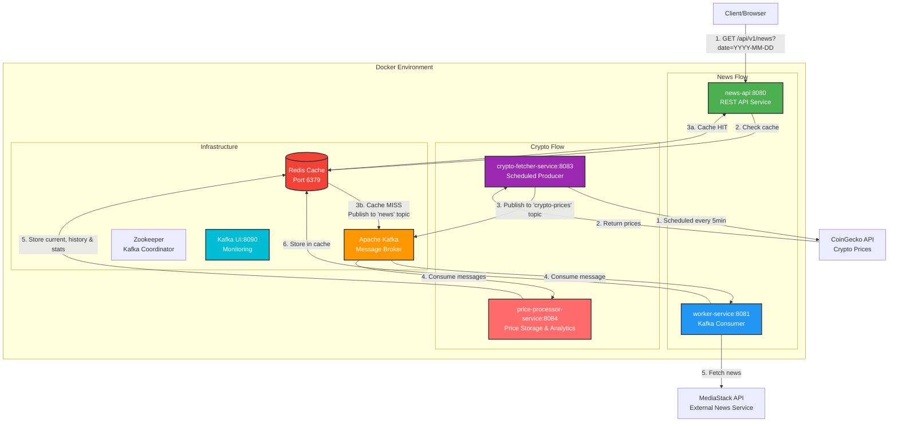

# Spring Boot Kafka Redis Microservices

A microservices architecture demonstrating event-driven communication using Apache Kafka, Redis caching, and Spring Boot with reactive programming and comprehensive Datadog observability.

## Architecture Overview

This project implements a cache-aside pattern with asynchronous data fetching through Kafka messaging. The system includes three main flows:

1. **News Flow**: Fetches news data from MediaStack API on demand
2. **Crypto Flow**: Scheduled fetching of cryptocurrency prices from CoinGecko API
3. **Price Processing**: Consumes crypto prices, stores data, calculates statistics, and generates alerts

### Architecture Diagram


<details>
<summary>View Mermaid Source (click to expand)</summary>



---

## Crypto Tracker Tutorial Progress

This project includes a learning tutorial for building a Crypto Price Tracker. See [CRYPTO_TRACKER_TUTORIAL.md](CRYPTO_TRACKER_TUTORIAL.md) for the complete guide.

### Phase 1: Crypto Fetcher Service - ✅ COMPLETED
- [x] Create module `crypto-fetcher-service`
- [x] Configure CoinGecko API client with WebClient
- [x] Implement scheduled job with `@Scheduled`
- [x] Create topic `crypto-prices`
- [x] Publish prices to Kafka with message keys
- [x] Verify messages in Kafka UI

### Phase 2: Price Processor Service - ✅ COMPLETED
- [x] Create module `price-processor-service`
- [x] Configure Kafka consumer with ErrorHandlingDeserializer
- [x] Implement Redis storage logic (current price, history, stats)
- [x] Calculate statistics (min, max, avg) with running average algorithm
- [x] Implement Datadog price monitoring with automatic alerts for >5% changes

### Phase 3: Alert Service - 🚧 IN PROGRESS
- [ ] Create module `alert-service`
- [ ] Implement change detection logic
- [ ] Create topic `price-alerts`
- [ ] Publish alerts

### Phase 4: Crypto API - ✅ COMPLETED
- [x] Create module `crypto-api`
- [x] Configure Jackson JSR310 for Java 8 Time types
- [x] Implement reactive REST endpoints for current prices
- [x] Add endpoints for price history and statistics
- [x] Enable Datadog tracing and metrics

---

## Components

### 1. news-api (Port 8080)
**REST API Service** - Handles client requests and manages cache
- **Technology**: Spring Boot 3.5.7, Spring WebFlux (Reactive)
- **Role**: Producer service
- **Responsibilities**:
  - Exposes REST endpoint for news retrieval
  - Validates date format (YYYY-MM-DD)
  - Checks Redis cache for requested data
  - Publishes messages to Kafka on cache miss
  - Returns cached data on cache hit
  - **Datadog Integration**: Redis cache metrics, Kafka traces, custom alerting

### 2. worker-service (Port 8081)
**Background Worker** - Processes Kafka messages and fetches external data
- **Technology**: Spring Boot 3.5.7, Spring WebFlux, WebClient
- **Role**: Consumer service
- **Responsibilities**:
  - Listens to Kafka topic "news"
  - Fetches news from MediaStack API
  - Stores fetched data in Redis cache
  - Handles external API errors gracefully
  - **Datadog Integration**: Processing metrics and error tracking

### 3. crypto-fetcher-service (Port 8083)
**Scheduled Producer** - Fetches crypto prices and publishes to Kafka
- **Technology**: Spring Boot 3.5.7, Spring WebFlux, WebClient
- **Role**: Scheduled producer service
- **Responsibilities**:
  - Fetches prices from CoinGecko API every 5 minutes
  - Publishes to Kafka topic "crypto-prices"
  - Uses message keys (BTC, ETH, SOL) for partitioning
  - **Datadog Integration**: Producer metrics and API call tracking

### 4. price-processor-service (Port 8084)
**Price Storage and Analytics** - Consumes crypto prices and stores data
- **Technology**: Spring Boot 3.5.7, Spring Data Redis Reactive
- **Role**: Consumer service
- **Responsibilities**:
  - Listens to Kafka topic "crypto-prices"
  - Stores current price in Redis: `crypto:current:{symbol}`
  - Maintains price history in Redis: `crypto:history:{symbol}`
  - Calculates statistics: `crypto:stats:{symbol}` (min, max, avg, count)
  - **Datadog Integration**: Price change metrics, automatic alerts for >5% changes, volatility calculations

### 5. Apache Kafka + Zookeeper
**Message Broker** - Enables asynchronous communication
- **Image**: confluentinc/cp-kafka:7.5.0
- **Topics**:
  - `news` - News date requests
  - `crypto-prices` - Cryptocurrency price updates
  - **Purpose**: Decouples services and enables async processing

### 6. Redis
**Cache Layer** - Stores data for fast retrieval
- **Image**: redis:latest
- **Purpose**: Fast data retrieval and reduced external API calls
- **Key Patterns**:
  - News: Date strings (YYYY-MM-DD)
  - Crypto Current: `crypto:current:{symbol}` (e.g., `crypto:current:BTC`)
  - Crypto History: `crypto:history:{symbol}` (List of historical prices)
  - Crypto Stats: `crypto:stats:{symbol}` (min, max, avg, count)

### 7. Kafka UI (Port 8090)
**Monitoring Dashboard** - Visual interface for Kafka
- **Image**: provectuslabs/kafka-ui:latest
- **Purpose**: Monitor topics, messages, consumers, and brokers
- **Access**: http://localhost:8090

---

## Communication Flow

### News Flow - First Request (Cache Miss)
```
1. Client → GET /api/v1/news?date=2024-01-15
2. news-api → Check Redis cache
3. Redis → Cache MISS (no data found)
4. news-api → Publish "2024-01-15" to Kafka topic "news"
5. news-api → Return 404 with message "Data not found, sending request to broker"
6. worker-service → Consume message from Kafka
7. worker-service → Call MediaStack API with date parameter
8. MediaStack API → Return news data
9. worker-service → Store data in Redis with key "2024-01-15"
```

### News Flow - Subsequent Requests (Cache Hit)
```
1. Client → GET /api/v1/news?date=2024-01-15
2. news-api → Check Redis cache
3. Redis → Cache HIT (data found)
4. news-api → Return 200 OK with cached news data
```

### Crypto Flow - Complete Process
```
1. Scheduler triggers every 5 minutes in crypto-fetcher-service
2. crypto-fetcher-service → Call CoinGecko API for BTC, ETH, SOL
3. CoinGecko API → Return current prices
4. crypto-fetcher-service → Publish each price to Kafka topic "crypto-prices"
5. price-processor-service → Consume messages from Kafka
6. price-processor-service → Store in Redis:
   - Current price: `crypto:current:{symbol}`
   - Price history: `crypto:history:{symbol}`
   - Statistics: `crypto:stats:{symbol}`
```

---

## Datadog Observability

### Implemented Features
- **APM Tracing**: Distributed tracing across all microservices
- **Custom Metrics**: Price changes, volatility, cache performance
- **Automatic Alerts**: Price change detection with configurable thresholds
- **Real-time Monitoring**: Redis, Kafka, and HTTP metrics
- **Log Correlation**: Structured logging with trace IDs

### Available Metrics
- **Price Metrics**: `price.current`, `price.change.percent`, `price.alerts`, `price.volatility`
- **Processing Metrics**: `price.processing.duration`, `price.processing.operations`
- **Kafka Metrics**: `kafka.consumer.duration`, `kafka.consumer.messages`
- **Cache Metrics**: `redis.cache.operations`, `redis.cache.hits/misses`
- **Alert Metrics**: Automatic notifications for >5% price changes

---

## Technology Stack

| Technology | Version | Purpose |
|------------|---------|---------|
| Java | 17 | Programming language |
| Spring Boot | 3.5.7 | Application framework |
| Spring WebFlux | - | Reactive web framework |
| Spring Kafka | - | Kafka integration |
| Spring Data Redis | - | Redis integration |
| Project Reactor | - | Reactive programming |
| Gradle | 8.x | Build tool |
| Docker | - | Containerization |
| Apache Kafka | 7.5.0 | Message broker |
| Redis | latest | Caching layer |
| Kafka UI | latest | Monitoring dashboard |
| Datadog | latest | Observability platform |
| MediaStack API | v1 | External news API |
| CoinGecko API | v3 | Cryptocurrency prices |

---

## Communication Flow

### News Flow - First Request (Cache Miss)
```
1. Client → GET /api/v1/news?date=2024-01-15
2. news-api → Check Redis cache
3. Redis → Cache MISS (no data found)
4. news-api → Publish "2024-01-15" to Kafka topic "news"
5. news-api → Return 404 with message "Data not found, sending request to broker"
6. worker-service → Consume message from Kafka
7. worker-service → Call MediaStack API with date parameter
8. MediaStack API → Return news data
9. worker-service → Store data in Redis with key "2024-01-15"
```

### News Flow - Subsequent Requests (Cache Hit)
```
1. Client → GET /api/v1/news?date=2024-01-15
2. news-api → Check Redis cache
3. Redis → Cache HIT (data found)
4. news-api → Return 200 OK with cached news data
```

### Crypto Flow - Complete Process
```
1. Scheduler triggers every 5 minutes in crypto-fetcher-service
2. crypto-fetcher-service → Call CoinGecko API for BTC, ETH, SOL
3. CoinGecko API → Return current prices
4. crypto-fetcher-service → Publish each price to Kafka topic "crypto-prices"
5. price-processor-service → Consume messages from Kafka
6. price-processor-service → Store in Redis:
   - Current price: `crypto:current:{symbol}`
   - Price history: `crypto:history:{symbol}`
   - Statistics: `crypto:stats:{symbol}`
```

---

## Technology Stack

| Technology | Version | Purpose |
|------------|---------|---------|
| Java | 17 | Programming language |
| Spring Boot | 3.5.7 | Application framework |
| Spring WebFlux | - | Reactive web framework |
| Spring Kafka | - | Kafka integration |
| Spring Data Redis | - | Redis integration |
| Project Reactor | - | Reactive programming |
| Gradle | 8.x | Build tool |
| Docker | - | Containerization |
| Apache Kafka | 7.5.0 | Message broker |
| Redis | latest | Caching layer |
| Kafka UI | latest | Monitoring dashboard |
| Datadog | latest | Observability platform |
| MediaStack API | v1 | External news API |
| CoinGecko API | v3 | Cryptocurrency prices |

---

## Prerequisites

- Docker and Docker Compose
- Java 17 or higher
- Gradle 8.x
- Datadog API key (configured via DD_API_KEY)

---

## Getting Started

### 1. Clone the repository
```bash
git clone <repository-url>
cd spring-kafka-redis-root
```

### 2. Build the project
```bash
./gradlew clean build -x test
```

### 3. Start all services with Docker Compose
```bash
docker-compose up -d --build
```

### 4. Verify services are running
```bash
docker-compose ps
```

You should see all containers running:
- zookeeper
- kafka
- kafka-ui
- redis
- news-api
- worker-service
- crypto-fetcher-service
- price-processor-service

### 5. Access Kafka UI
Open http://localhost:8090 to monitor:
- Topics and their messages
- Consumer groups
- Broker status

---

## API Endpoints

### News API

#### Get News by Date
**Endpoint**: `GET /api/v1/news?date={date}`
**Parameters**:
- `date` (required): Date in format YYYY-MM-DD

**Example Request**:
```bash
curl "http://localhost:8080/api/v1/news?date=2024-01-15"
```

**First Request Response** (Cache Miss - 404):
```json
{
  "message": "Data not found, sending request to broker",
  "status": false
}
```

**Subsequent Request Response** (Cache Hit - 200):
```json
{
  "message": "Data found",
  "status": true,
  "data": {
    "pagination": {...},
    "data": [
      {
        "author": "John Doe",
        "title": "Breaking News...",
        "description": "...",
        "url": "...",
        "source": "...",
        "category": "general",
        "published_at": "2024-01-15T10:00:00+00:00"
      }
    ]
  }
}
```

### Crypto API

#### Get All Current Prices
**Endpoint**: `GET /api/v1/crypto/prices`
**Response**:
```json
[
  {
    "symbol": "BTC",
    "name": "Bitcoin",
    "priceUsd": 43250.50,
    "priceChange24h": 2.5,
    "marketCap": 840000000000,
    "timestamp": "2024-01-15T10:00:00Z"
  },
  {
    "symbol": "ETH", 
    "name": "Ethereum",
    "priceUsd": 2250.75,
    "priceChange24h": -1.2,
    "marketCap": 270000000000,
    "timestamp": "2024-01-15T10:00:00Z"
  },
  {
    "symbol": "SOL",
    "name": "Solana", 
    "priceUsd": 102.75,
    "priceChange24h": -2.16,
    "marketCap": 58000000000,
    "timestamp": "2024-01-15T10:00:00Z"
  }
]
```

#### Get Specific Price by Symbol
**Endpoint**: `GET /api/v1/crypto/prices/{symbol}`
**Parameters**:
- `symbol` (required): Cryptocurrency symbol (BTC, ETH, SOL)

**Example Request**:
```bash
curl "http://localhost:8086/api/v1/crypto/prices/BTC"
```

**Response**:
```json
{
  "symbol": "BTC",
  "name": "Bitcoin",
  "priceUsd": 43250.50,
  "priceChange24h": 2.5,
  "marketCap": 840000000000,
  "timestamp": "2024-01-15T10:00:00Z"
}
```

#### Get Price Statistics
**Endpoint**: `GET /api/v1/crypto/stats/{symbol}`
**Response**:
```json
{
  "symbol": "BTC",
  "currentPrice": 43250.50,
  "minPrice": 42000.00,
  "maxPrice": 45000.00,
  "avgPrice": 43250.25,
  "sampleCount": 150,
  "lastUpdated": "2024-01-15T10:05:00Z"
}
```

### Crypto Fetcher Service

The crypto-fetcher-service runs automatically and publishes prices to Kafka every 5 minutes. You can monitor the scheduled jobs in the application logs.

### Message Format in Kafka

#### News Topic
**Key**: News date (YYYY-MM-DD)
**Value**: News article object

#### Crypto Prices Topic
**Key**: Cryptocurrency symbol (BTC, ETH, SOL)
**Value**: CryptoPrice object
```json
{
  "symbol": "BTC",
  "name": "Bitcoin",
  "priceUsd": 43250.50,
  "priceChange24h": 2.5,
  "marketCap": 840000000000,
  "timestamp": "2024-01-15T10:00:00Z"
}
```

---

## Environment Variables

### news-api
| Variable | Description | Default |
|----------|-------------|---------|
| KAFKA_SERVER | Kafka bootstrap server | kafka:29092 |
| REDIS_SERVER | Redis host | redis |
| REDIS_PORT | Redis port | 6379 |
| REDIS_PASSWORD | Redis password | myredis |
| DD_SERVICE | Datadog service name | news-api |
| DD_ENV | Datadog environment | docker-local |

### worker-service
| Variable | Description | Default |
|----------|-------------|---------|
| KAFKA_SERVER | Kafka bootstrap server | kafka:29092 |
| REDIS_SERVER | Redis host | redis |
| REDIS_PORT | Redis port | 6379 |
| REDIS_PASSWORD | Redis password | myredis |
| MEDIASTACK_URI | MediaStack API endpoint | http://api.mediastack.com/v1/news |
| MEDIASTACK_API_KEY | MediaStack API key | (configured in docker-compose.yml) |
| DD_SERVICE | Datadog service name | worker-service |
| DD_ENV | Datadog environment | docker-local |

### crypto-fetcher-service
| Variable | Description | Default |
|----------|-------------|---------|
| KAFKA_SERVER | Kafka bootstrap server | kafka:29092 |
| DD_SERVICE | Datadog service name | crypto-fetcher-service |
| DD_ENV | Datadog environment | docker-local |

### price-processor-service
| Variable | Description | Default |
|----------|-------------|---------|
| KAFKA_SERVER | Kafka bootstrap server | kafka:29092 |
| REDIS_SERVER | Redis host | redis |
| REDIS_PORT | Redis port | 6379 |
| REDIS_PASSWORD | Redis password | myredis |
| DD_SERVICE | Datadog service name | price-processor-service |
| DD_ENV | Datadog environment | docker-local |

---

## Development

### Build specific module
```bash
./gradlew :news-api:build
./gradlew :worker-service:build
./gradlew :crypto-fetcher-service:build
./gradlew :price-processor-service:build
```

### Run tests
```bash
./gradlew test
```

### Run locally (without Docker)
Make sure Kafka, Zookeeper, and Redis are running, then:
```bash
# Terminal 1 - news-api
cd news-api
../gradlew bootRun

# Terminal 2 - worker-service
cd worker-service
../gradlew bootRun

# Terminal 3 - crypto-fetcher-service
cd crypto-fetcher-service
../gradlew bootRun

# Terminal 4 - price-processor-service
cd price-processor-service
../gradlew bootRun
```

### Clean and rebuild
```bash
./gradlew clean build
docker-compose down -v
docker-compose up -d --build
```

---

## Key Features

- **Reactive Programming**: Non-blocking I/O with Spring WebFlux and Project Reactor
- **Event-Driven Architecture**: Decoupled services communicating via Kafka
- **Cache-Aside Pattern**: Redis caching for improved performance
- **Scheduled Jobs**: Automatic crypto price fetching with `@Scheduled`
- **Message Keys**: Kafka partitioning for ordered processing per symbol
- **Error Handling**: Comprehensive error handling for external API failures and message deserialization
- **Datadog Observability**: Complete monitoring with APM traces and custom metrics
- **Automatic Price Alerts**: Detect significant price changes (>5%) with notifications
- **Running Statistics**: Efficient min/max/avg calculation with running average
- **Containerization**: Fully containerized with Docker Compose
- **Scalability**: Kafka consumer groups allow horizontal scaling

---

## Troubleshooting

### Kafka connection errors
```bash
# Check if Kafka is healthy
docker-compose logs kafka
# Restart Kafka
docker-compose restart kafka
```

### Redis connection errors
```bash
# Check Redis logs
docker-compose logs redis
# Test Redis connection
docker exec -it <redis-container> redis-cli -a <password> -h <host> -p <port> PING
```

### Service not starting
```bash
# Check service logs
docker-compose logs news-api
docker-compose logs worker-service
docker-compose logs crypto-fetcher-service
docker-compose logs price-processor-service
# Rebuild from scratch
docker-compose down -v
./gradlew clean build
docker-compose up -d --build
```

### Verify Kafka topics
```bash
# Access Kafka UI
open http://localhost:8090
# Or use CLI
docker exec -it <kafka-container> kafka-topics --list --bootstrap-server localhost:9092
```

### Port already in use
```bash
# Check what's using ports
lsof -i :8080
lsof -i :8081
lsof -i :8083
lsof -i :8084
lsof -i :8090

# Stop and remove volumes (clears Redis data)
docker-compose down -v
# Rebuild
docker-compose up -d --build
```

## Stopping the Application
```bash
# Stop all containers
docker-compose down

# Stop and remove volumes (clears Redis data)
docker-compose down -v
```

## License

This project is for educational purposes.

---

## Author

Alexander Londoño Espejo

---

## Project Structure

```
spring-kafka-redis-root/
├── news-api/                        # REST API Service
│   ├── src/main/java/
│   │   └── com/alexlondon07/news_api/
│   │       ├── config/              # Kafka, Redis configs
│   │       ├── controller/          # REST controllers
│   │       ├── service/             # Business logic
│   │       ├── repository/          # Redis operations
│   │       ├── models/              # DTOs and responses
│   │       └── utils/               # Constants and utilities
│   ├── Dockerfile
│   └── build.gradle
├── worker-service/                  # Kafka Consumer Service
│   ├── src/main/java/
│   │   └── com/alexlondon07/worker_service/
│   │       ├── config/              # Kafka, Redis, WebClient configs
│   │       ├── listener/            # Kafka listeners
│   │       ├── service/             # MediaStack integration
│   │       ├── repository/          # Redis operations
│   │       ├── model/               # Domain models
│   │       └── utils/               # Constants
│   ├── Dockerfile
│   └── build.gradle
├── crypto-fetcher-service/          # Scheduled Crypto Producer
│   ├── src/main/java/
│   │   └── com/alexlondon07/crypto_fetcher_service/
│   │       ├── config/              # Kafka, WebClient configs
│   │       ├── scheduler/           # Scheduled jobs
│   │       ├── service/             # CoinGecko integration
│   │       ├── model/               # CryptoPrice DTO
│   │       └── utils/               # Constants
│   ├── Dockerfile
│   └── build.gradle
├── price-processor-service/        # Price Storage & Analytics
│   ├── src/main/java/
│   │   └── com/alexlondon07/price_processor_service/
│   │       ├── config/              # Kafka, Redis configs
│   │       ├── listener/            # Kafka listeners
│   │       ├── service/             # Price storage & stats logic
│   │       ├── repository/          # Redis operations
│   │       ├── model/               # CryptoPrice, PriceStats models
│   │       └── utils/               # Constants
│   ├── Dockerfile
│   └── build.gradle
├── docker-compose.yml               # Container orchestration
├── build.gradle                     # Root build configuration
├── settings.gradle                  # Multi-module setup
├── CLAUDE.md                       # AI assistant instructions
├── CRYPTO_TRACKER_TUTORIAL.md       # Learning tutorial
└── README.md                        # This file
```

---

## Key Features

- **Reactive Programming**: Non-blocking I/O with Spring WebFlux and Project Reactor
- **Event-Driven Architecture**: Decoupled services communicating via Kafka
- **Cache-Aside Pattern**: Redis caching for improved performance
- **Scheduled Jobs**: Automatic crypto price fetching with `@Scheduled`
- **Message Keys**: Kafka partitioning for ordered processing per symbol
- **Error Handling**: Comprehensive error handling for external API failures and message deserialization
- **Datadog Observability**: Complete monitoring with APM traces and custom metrics
- **Automatic Price Alerts**: Detect significant price changes (>5%) with notifications
- **Running Statistics**: Efficient min/max/avg calculation with running average algorithm
- **Containerization**: Fully containerized with Docker Compose
- **Scalability**: Kafka consumer groups allow horizontal scaling

---

## Future Enhancements

- [x] **Phase 2**: Price Processor Service - Store prices and calculate stats ✅ COMPLETED
- [ ] **Phase 3**: Alert Service - Detect significant price changes 🚧 IN PROGRESS
- [x] **Phase 4**: Crypto API - REST endpoints for crypto data  ✅ COMPLETED
- [ ] Add authentication and authorization
- [ ] Implement circuit breaker pattern for external API calls
- [ ] Add metrics and monitoring (Prometheus, Grafana)
- [ ] Implement distributed tracing (Zipkin, Jaeger)
- [ ] Add API rate limiting
- [ ] Add API documentation (Swagger/OpenAPI)
- [ ] Implement Kafka Streams for real-time processing
- [ ] Add WebSocket for live price updates
- [ ] Add Kubernetes deployment manifests